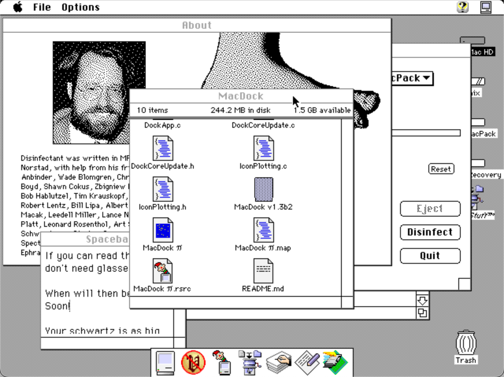

MacDock 1.32 ©August 2023 by Mike
Dedicated to those of us still using these machines 40 years later...
 

System Requirements:
* System 7.x - MacOS 8.x
* AppleScript with Finder Scripting Extension for full features

Description:
MacDock is like the Dock in modern macOS but for System 7 and 8.
To use it, simply launch the program.  MacDock will be visible at the bottom of your screen.  

You will see your running applications on the list (limited to 7 applications).  

* Clicking on any of them switches you to the app.
* Cmd + clicking reveals that application in the Finder
* Option + clicking hides the current application and switches to the clicked application (only when clicking from a non-MacDock application)

Options:
* Auto Hide (Cmd+H) - Tucks away the Dock partially when the app is not in focus, for easier viewing of MacDock behind cluttered desktops
* Show in Dock (Cmd+D) - Shows MacDock in the dock 

Updates:
Follow along at https://tinkerdifferent.com/threads/macdock-dev-progress-like-todays-macos-dock-but-for-system-7.2583/

This program is care-ware.  If you enjoy it, do something nice to someone today!

Release Notes
- v1.32 -- 8/29/2023
  - Added support for MacOS 8 (by fixing an OS 8-specific issue occuring when "Show In Dock" was selected, causing a blank Dock)
- v1.31 -- 8/21/2023
  - New icon!  It's not Susan Kare but it's nice :-D
  - Fixed an issue on color screens where applications that only have a black & white icon that caused those apps to show up as generic app icons
  - Fixed versioning in the About... box.
- v1.3 -- 8/18/2023
  - Added support for color
- v1.2 -- 7/6/2023
  - Added command + click to reveal app in Finder
- v1.1 -- 5/8/2023
  - No longer keeps After Dark screensavers from triggering when idle
  - Reduced CPU utilization to 1/10th - 1/100th by being selective about when to redraw the Dock and its icons
  - Added "About MacDock..." dialog
- v1.0
  - Initial release
